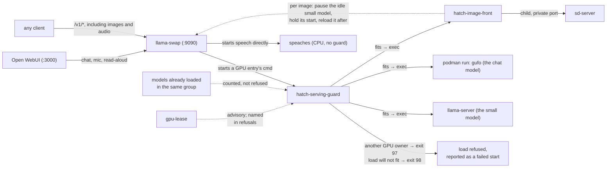

# Running jaki day to day

**Status: current (2026-10-05).** Deployed on the reference machine. Installing from nothing is
[`machines/jaki/README.md`](../../../machines/jaki/README.md); writing a client is
[`clients.md`](../../../machines/jaki/clients.md) beside it. This page is for operating the
server once it runs.

This directory holds the files that run the server: the router's config (`llama-swap.yaml`), the
systemd user units (`llama-swap.service`, `open-webui.service`, `hatch-pressure-watch.service`),
the fetchers for the binaries and the speech models, the resumable image puller, the image front
and the admission guard. `hatch install` symlinks each file to where the machine reads it, so
editing a file here and restarting its unit is the whole update.

Every model, flag, sampling value and the evidence for each are in
[`engine/models.toml`](../../models.toml), which wins wherever a document disagrees.

## What is running

`llama-swap` on `:9090` is the only process on the machine that serves a model, and every client
asks it: the chat surface, agent harnesses, batch jobs. It holds four entries in one group.
Loading one never unloads another, so entries accumulate as they are asked for and stay loaded.

| entry | answers | size | in `/v1/models` | unloads |
|---|---|---|---|---|
| `qnext` | the chat model: chat, drafting, long documents, images in; gufo in a podman container | 89 GiB | yes | never, once loaded |
| `qwen3.5-4b` | the small model: short mechanical jobs such as tagging or transcript cleanup | 3 GB | no | never, once loaded |
| `zimage` | the image model: Z-Image-Turbo through `sd-server` | 11 GB | no | after 15 idle minutes |
| `speech` | transcription and speech synthesis: speaches on the CPU | 2 GB | no | never, once started |

The lease and the guard call the two standing GPU models *residents*; that is the word in their
flags and in `engine/lib/gpu-binaries.env`.

“Never, once loaded” is `ttl: 0` in the router config, and it does not mean always loaded.
Nothing preloads an entry: a freshly started router holds nothing, and each entry loads on the
first request for it (see *After a boot*).

The three entries other than `qnext` are `unlisted`. That keeps them out of every model picker,
and a client still reaches them by id. The chat surface therefore shows one model.

**Memory.** Against the GPU's 124 GiB, with the chat model at its 131,072-token window and two
sessions (measured 2026-10-05):

| state | GPU memory (GTT, GiB) | MemAvailable (GiB) |
|---|--:|--:|
| chat model alone | 89.2 | – |
| peak with every model busy at once: a ~118k-token request on each session, the small model, a search and an image | 114.6 | 1.1 at the lowest, below 3 for 26 s |

That peak sent its image straight to sd-server. In production the image front pauses the small
model first and admits an image only with 11.5–17 GiB plus a 4 GiB floor free, so production
does not reach that low point by the same route. At the earlier 65,536-token window the chat and
small model held 89.3 GiB together and one image peaked at 106; neither has been measured at the
current window.

The chat model serves two requests at once (`--sessions 2`) with its RAM cache capped at 4 GiB.
Four sessions ran out of memory with every model busy. The reason for each flag is in
`[models.qnext.serve]` in `engine/models.toml`.

`sd-server` loads its weights on the first image request, so the image model adds about 10 GiB
only after someone has asked for an image. gufo allocates its memory up front and holds no page
cache that could give way. That is why the small model pauses for each image, and why the image
front and the pressure watcher exist (see *The admission guard*). The full table, with the state
each figure was measured in, is `[models.zimage].note` in `engine/models.toml`.

The speech server uses no GPU memory. Its container idles at about 60 MB of RAM and uses about
2.5 GiB while whisper is loaded, which it releases 300 s after the last transcription.
Transcribing a 1.3 s recording through the router takes 3.7 s on the first request after the
container starts and 2.7 s after that; synthesis takes well under a second (measured
2026-09-10).

## Routing details

**Images go to the chat model**, which reads them with the projector loaded on its own command
line. There is no separate vision model.

**The speech ids are speaches' own model names.** The router starts one process per model id, so
short ids such as `stt` and `tts` would mean three containers. One entry with the speaches names
as aliases runs one container and passes each request body through unchanged, so a caller names
the model it gets. speaches' own alias `whisper-1` does not route, because it resolves to a
whisper model this machine does not hold. `tts-1` and `tts-1-hd` do route: speaches maps them to
Kokoro, and `tts-1` is what Open WebUI's read-aloud sends by default.

**The chat surface** is at `http://<address>:3000`. It has one model in its picker, a microphone
button that transcribes German or English, a read-aloud button with an English voice, and file
uploads that go into the context whole. Its history is in the `open-webui` podman volume.

**Services that `hatch install` deploys read their endpoint from `resolved.env`**, which `hatch
install` writes from the machine's `[endpoints]`, and each names its own model. Once loaded, the
small model stays loaded (`ttl: 0`), so a batch job waits for a load only on the first request
after a boot or a router restart; `--resident serve` (below) removes that wait.

### Addresses and readiness

**The router binds only the address `serve_url` names.** A default of `127.0.0.1:9090` answers
nothing, even on the machine itself, where unattended batch jobs run. Give every client on the
machine the same address as clients elsewhere.

**`/health` says the router is up and nothing about any model.** It answers 200 whatever the
router holds, including nothing. To know whether a model is up, look for its id in `/running`,
or send a real one-token completion. A readiness check on `/health` reports ready, and the job
that trusted it then waits for a cold load inside its own timeout.

### After a boot

`ttl: 0` stops an entry from unloading; it does not load it. The first request after a boot
waits for the load: 25–30 s for the chat model when its weights are in the page cache, 65–95 s
otherwise (measured 2026-09-28). To have the standing models loaded before a job needs them:

```
hatch gpu-lease acquire --who <name> --why <tag> --resident serve
```

`serve` loads every standing model, waits until each answers, then holds the lease so nothing
unloads them. It does not cover `speech`, which is not in `HATCH_ROUTER_RESIDENTS`: the first
speech request after a router restart waits a few seconds for the container, which then stays
up.

## Taking the GPU for something else

The chat model holds most of the GPU, so the server and a long GPU job such as a benchmark
cannot run at the same time. Take the GPU with the lease, never with `systemctl stop`:

```
hatch gpu-lease launch --who <name> --why <tag> --resident stop -- <command>
```

`--resident stop` asks the router to unload its models through `POST /api/models/unload`, and
loads them again on release. There is no unit to stop by hand, since every model is a child
process of the router. Reloading can take up to 300 s per standing model, so 600 s for both when
the chat model's weights are not in the page cache; a warm reload took 23 to 25 s.

`--resident stop` also stops the speech server. It comes back on the next speech request instead
of on release, because it is not in `HATCH_ROUTER_RESIDENTS`; that list names what holds the
GPU, and the speech server holds none.

## Checking it

```
./jaki check      # weights, binaries, the engine image, speech models, deployed files
./jaki smoke      # one request per modality, each answer checked by its content
```

`./jaki check` runs three fetchers' own checks, which need no GPU and no router, plus `hatch
doctor`:

```
download-candidates --check    # every weight file at its exact size
serving-binaries --check       # the binaries and the chat model's engine image against their digests
speaches-models --check        # the speech models in the cache
```

[`client-contract-probe.py`](client-contract-probe.py) checks what a request may override on the
two text models – `max_tokens`, `temperature`, `reasoning_effort`, thinking off,
`response_format` – each against a request that leaves the setting out. It takes about ten
minutes.

**Where each server logs.** The router's requests: `journalctl --user -u llama-swap`. The chat
model, gufo in its container: `journalctl --user CONTAINER_NAME=hatch-qnext`, one
`event=completed` line per request with its prompt size, cache reuse and speed. The small model
and the image server write `--log-file`s under `~/.local/state/llama-swap-logs/`, because
llama-swap passes on none of a child's output. The memory watcher: `journalctl --user -u
hatch-pressure-watch`.

**Test a check before trusting its pass.** Break one thing on purpose – a wrong
`reasoning_effort`, an invented flag, a model id no entry serves – and confirm the check names
it. A check that no longer finds its target still reports a pass.

## What `hatch install` places, and how to update it

`./jaki` at the repository root runs the whole install and the commands after it (`check`,
`start`, `stop`, `status`, `smoke`, `client-config`), printing each command it runs. This
section says what the install does.

The machine's toml lists `infra = ["model-serving", ...]`, and `hatch install` symlinks every
piece into this checkout: seven commands on PATH (`hatch-serving-guard`, `hatch-image-front`,
`hatch-pressure-watch`, `owui-bringup`, `pull-image-resumable`, `speaches-models`,
`serving-binaries`), the units, and `llama-swap.yaml` at `~/.config/llama-swap/config.yaml`. It
enables the units the machine's `[units].enabled` names; starting them is left to you. `hatch
doctor` checks each link by name and reports one that is stale or dangling.

The router reads its config only at start (its command line passes `--config`, never
`-watch-config`), so run `systemctl --user restart llama-swap` after every edit.

The small model's engine, the router and the image server are upstream releases.
`serving-binaries` fetches them from the `[[binaries]]` rows in `engine/models.toml`, checks the
digest of every download, unpacks each where the config expects it, and records which pin
produced it. The router finds each binary through a `HATCH_BIN_*` variable that `hatch install`
writes, so updating one takes three steps: `serving-binaries`, `hatch install`, restart.
`serving-binaries --check` reports a binary that is missing or not from its pinned archive.

The first Open WebUI account becomes the admin. Sign-up stays open after that
(`ENABLE_SIGNUP=True`), so anyone who can reach the address can register; new accounts are
`pending` and cannot chat until an admin approves them. The first start takes 10–20 minutes
before the port opens, while Open WebUI builds its database and loads its embedding model.

### Open WebUI's settings live in `open-webui.service`, and its database is ignored

With `ENABLE_PERSISTENT_CONFIG=False` in the unit, Open WebUI takes every setting from the
environment and reads none from its database (`backend/open_webui/models/config.py`). That is
what lets the install finish without a visit to seven settings pages in the browser. The cost is
that a change made in Admin Settings applies at once and is gone at the next restart, because it
is written only to memory. The unit is the only place a change lasts: edit it, then run
`systemctl --user restart open-webui`.

The unit sets three things a fresh Open WebUI gets wrong:

- **Audio.** Both engines are OpenAI-compatible against `HATCH_SERVE_URL`: speech in is
  `deepdml/faster-whisper-large-v3-turbo-ct2`, speech out `speaches-ai/Kokoro-82M-v1.0-ONNX`
  with voice `af_heart`, and the key is any non-empty value. The voice must be one Kokoro has.
  Open WebUI asks for the voice list without naming a model, so the router cannot route that
  request, and the browser's voice menu falls back to OpenAI's voice names, which speaches
  rejects. German speech out is `speaches-ai/piper-de_DE-thorsten-medium` with voice
  `de_DE-thorsten-medium`; Open WebUI holds one speech-out model, so switching language means
  editing those two lines.
- **Titles and tags come from the small model.** `OPENAI_API_CONFIGS` lists `qnext` and
  `qwen3.5-4b` as the connection's models, which replaces Open WebUI's request to `/v1/models`,
  and `TASK_MODEL_EXTERNAL=qwen3.5-4b` names the small model for those tasks. Open WebUI uses a
  task model only when it knows it, and otherwise falls back to the chat model in silence. A
  model with no entry in Open WebUI's database is shown to admins only, so users never see the
  small model in their picker. Follow-up suggestions are off
  (`ENABLE_FOLLOW_UP_GENERATION=False`): each was one more chat-model request per answer.
- **Uploaded files go into the context whole.** `BYPASS_EMBEDDING_AND_RETRIEVAL=True` and
  `RAG_FULL_CONTEXT=True` do this. By default Open WebUI splits a file, embeds the pieces and
  passes the model only the few that match, so the model sees part of the file without saying
  so. With the whole file in the context, the limit is the context window: 131k tokens on the
  chat model, 16k on the small model. A larger document is cut off without an error.

Check both after updating the image; the variable names are upstream's and can change.

The image is pinned to a release tag on the `ExecStart` line of `open-webui.service`, and `jaki`
and `owui-bringup` read the tag from there. To update: back up the database with sqlite3's
backup command from inside the container, edit the tag, pull, restart, and check the two
settings above. Most releases migrate the database, so going back needs that backup as well as
the old tag.

The pin is the standard image, 1.5 GiB compressed. The `-slim` variant is 168 MiB, but it cannot
read a PDF, Word or PowerPoint upload without an external extractor such as Tika or Docling,
fetches web pages without a headless browser, and loads the code interpreter's packages from a
CDN.

## Changing what is served

Change `engine/models.toml` first, then mirror the change into `llama-swap.yaml`. The
`[rejected.*]` settings in `engine/models.toml` were each measured and did worse;
`--cache-reuse` and `presence_penalty 1.5` are the two most easily added back by accident. Every
entry has a measured configuration; none is left at defaults.

**Single-quote any argument whose value contains double quotes.** The router splits `cmd` with
shell quoting rules, so a bare `--chat-template-kwargs {"enable_thinking":false}` reaches
llama-server as `{enable_thinking:false}`, which is invalid JSON, and the server exits before
serving. The entry then fails only when someone calls it, so it can stay broken for weeks
unnoticed.

**After editing an entry, load it once and check the answer's content, not the HTTP status.**
For the small model, `reasoning_content` must come back empty. For the chat model,
`/apply-template` must show the reasoning-effort sentence, and `timings.draft_n` on a real
request must show that speculative decoding is on; `/props` reports `speculative.types: none` on
a server that is speculating, so do not read it there. For speech, audio bytes must come back
and the transcript must say what was spoken.

**A missing file looks like a bad flag.** The router reports any early exit as `upstream command
exited prematurely`, whatever the cause. The small model's engine binary is at
`nathan-fork/<version>/vulkan/llama-server`; one release unpacked without that directory, so a
path copied from a working entry can point at nothing.

**A new speech model takes two edits:** `[models.speech].model_ids` in `engine/models.toml`, and
the alias list on the `speech` entry here. `speaches-models` reads `engine/models.toml`, so it
needs no third edit.

### Which of four kinds a new entry is

Anything that wants GPU memory is one of four kinds. This router serves the middle two.

| kind | for | how it is declared |
|---|---|---|
| standing | a model only a person takes down | an entry here with `ttl: 0`, **plus** its id in `HATCH_ROUTER_RESIDENTS` in [`engine/lib/gpu-binaries.env`](../../lib/gpu-binaries.env); on a machine that serves from its own unit instead, `HATCH_RESIDENTS` in the same file. A model in neither is invisible to the lease and the guard. |
| on demand | one request at a time, such as an image | an entry here with its `cmd` wrapped in `hatch-serving-guard`, a `ttl`, and its container named in `HATCH_CHAT_CONTAINERS` in the same file if it runs in one |
| CPU-only | a service that never uses the GPU | an entry here with no guard and no name in `gpu-binaries.env`, **in the `box` group** (see below) |
| bounded | benchmarks, evaluations, a batch of images | not this router: `hatch gpu-lease launch`, running its own server |

**Put every entry in the `box` group, GPU or not.** An entry in no group lands in the router's
`(default)` group, which is exclusive, so loading it would unload everything in `box`. That is
why `speech` is in `box` although it uses no GPU: without it, a dictation would unload the 89
GiB chat model.

**`persistent: true` does not keep an entry loaded.** It stops other groups from unloading the
entry, and nothing else; the entry's own `ttl` still applies. On v246 a persistent entry
survived another group's exclusive load and then logged `Unloading model, TTL of 15s reached`.
What keeps a standing model loaded is `ttl: 0`, and what tells the lease and the guard about it
is `HATCH_ROUTER_RESIDENTS`.

**The router's models never block a lease; the lease unloads them instead.** `gpu-lease` counts
this router's models as sanctioned use and never kills them, and `--resident stop` asks the
router to unload them before taking the GPU. A new GPU binary or container goes in
`engine/lib/gpu-binaries.env`, which is the one file every tool that asks who holds the GPU
reads. A name missing from it is invisible to all of them.

## The admission guard

Every GPU load goes through `hatch-serving-guard`, which refuses a load the memory cannot hold
before it can crash the machine:



**The small model pauses while an image generates.** An image's peak is the moment memory is
tightest, and the small model holds about 5 GiB of it. `hatch-image-front` sits in front of
sd-server. Before each image it writes a marker, waits up to 60 s for each model in
`HATCH_IMAGE_PAUSES` (`engine/lib/gpu-binaries.env`) to finish what it is doing, unloads it
through `POST /api/models/unload/<id>`, and after the image removes the marker and reloads it
with a one-token request. A request for the small model during the image starts it through the
guard, which holds the start for as long as the marker's writer is alive, up to 180 s. The
caller gets a slower answer and no error, unless one image runs past 180 s (exit 96). A model
still busy after the 60 s wait stays loaded, and the image goes ahead.

llama-swap's unload does not wait for a request in flight, so a request that arrives in the
milliseconds between the idle check and the unload is cut with a `5xx`. Callers should retry a
`5xx`. Only the synchronous image paths pause anything: sd-server's asynchronous `/sdcpp/v1`
queue answers before its image exists and is not covered. While an image runs, a `--resident
stop` lease counts the small model as loaded, so its release reloads it. `test-image-front.py`
exercises the whole path against stand-in servers.

**An image that does not fit is refused with a reason.** After the pause, the front needs
`MemAvailable` to cover what one image adds – 17 GiB while sd-server still has to load its
weights, 11.5 GiB once it has – plus a 4 GiB floor. It waits up to 60 s for that, then answers
`503` with the memory available, and reloads the small model. This happens only when every model
is busy at once, which no unload can help; the caller gets a message instead of a crash that
would take the chat model with it. `test-image-front.py` covers it.

**Idle models are unloaded when memory runs short.** `hatch-pressure-watch.service` reads
`MemAvailable` every second and, below 8 GiB, unloads the first loaded, idle entry in
`HATCH_UNLOAD_ORDER` – the image model, when no image is generating – and does not unload the
same entry again for 15 minutes. Each action is logged to `journalctl --user -u
hatch-pressure-watch` with the reading that caused it. The watcher and the guard read the image
marker and then unload, An image that starts between the watcher's marker check and its unload
is cut off, as with the small model's pause. A lock cannot prevent this, because unloading the
image model also stops `hatch-image-front`, which the image runs through.
`test-pressure-watch.sh` covers it against a stand-in router.

Without the guard, a second load does not wait. It runs the machine out of memory, and the
kernel kills both servers and unrelated processes, with neither server's log naming the other.

**The speech entry is outside the guard on purpose.** The guard refuses every load while a
benchmark or a `--resident stop` lease holds the GPU. A CPU-only server behind it would lose the
microphone every time the GPU was busy, for a refusal it never needed.

**Exit 97 means something else owns the GPU.** Four things cause it: a `llama-server` that is
neither in a known container nor started by the router; an active unit whose command, or a
script it runs, invokes a binary named in `HATCH_GPU_SERVERS` or `HATCH_GPU_TOOLS`
(`llama-server`, `sd-server`, `gufo`, `llama-bench`, `llama-cli`, `sd-cli`); a `gpu-lease` held
with `--resident stop`; and an unreadable `engine/lib/gpu-binaries.env`. Without that file the
guard cannot tell an idle GPU from one holding 99 GiB, so it refuses. The refusal prints the
pid, the container, the port and the total GPU memory in use. It prints GPU memory because a
server holding 99 GiB of GPU allocations shows almost no resident memory per process.

**Exit 98 means the load will not fit.** The guard adds up the model's files, its speculative
draft model (`-md`, `--model-draft` or `--spec-draft-model`), its `--mmproj` and an 8 GiB
margin, and compares the sum with `MemAvailable`. A `podman run` entry names paths inside the
container, which the guard cannot read, so it uses `resident_gib` from the `engine/models.toml`
block whose `swap_id` matches the entry's `HATCH_SWAP_ID`, and refuses when there is none.
Before refusing, the guard unloads the idle entries in `HATCH_UNLOAD_ORDER` through the router
and checks again. Either refusal names the `gpu-lease` holder, if there is one.

**The guard decides who owns the GPU by cgroup.** A container entry runs in its container's
cgroup and is recognised by its name in `HATCH_CHAT_CONTAINERS`; the chat model's container is
`hatch-qnext`. A host binary runs in `llama-swap.service`'s cgroup; the small model and the
image server do. Without these two tests the guard would take the router's own model for another
GPU owner and refuse every later load. Before sizing a container entry, the guard removes any
container already carrying its `--name`: the router is starting the entry, so such a container
is an orphan still holding memory.

**Neither test depends on unit names.** Benchmark units get a new name for every experiment; a
hand-kept list of names would stop matching without anyone noticing, and the memory check would
be the only protection left.

**One exception.** A `--resident stop` lease reloads the standing models through this guard when
it is released, and the guard refuses while such a lease holds the GPU, so the lease would
refuse its own reload. For that window it sets `restoring=1` in its label file, and `status
--takes-box` answers `no` while it is set. The memory check still applies to anything else that
arrives in that window.

## Optional: TLS and a hostname

On a Tailscale address, `tailscale serve --bg --https=443 http://<address>:3000` publishes Open
WebUI as `https://<hostname>.<tailnet>.ts.net` with a real certificate. Open WebUI binds the
machine's address, as the router does, so proxy that address and never `127.0.0.1:3000`, which
answers 502 with no obvious cause. HTTPS serving has to be enabled once for the tailnet in the
Tailscale admin console. Nothing like it sits in front of `:9090`; the router binds the address
itself.
